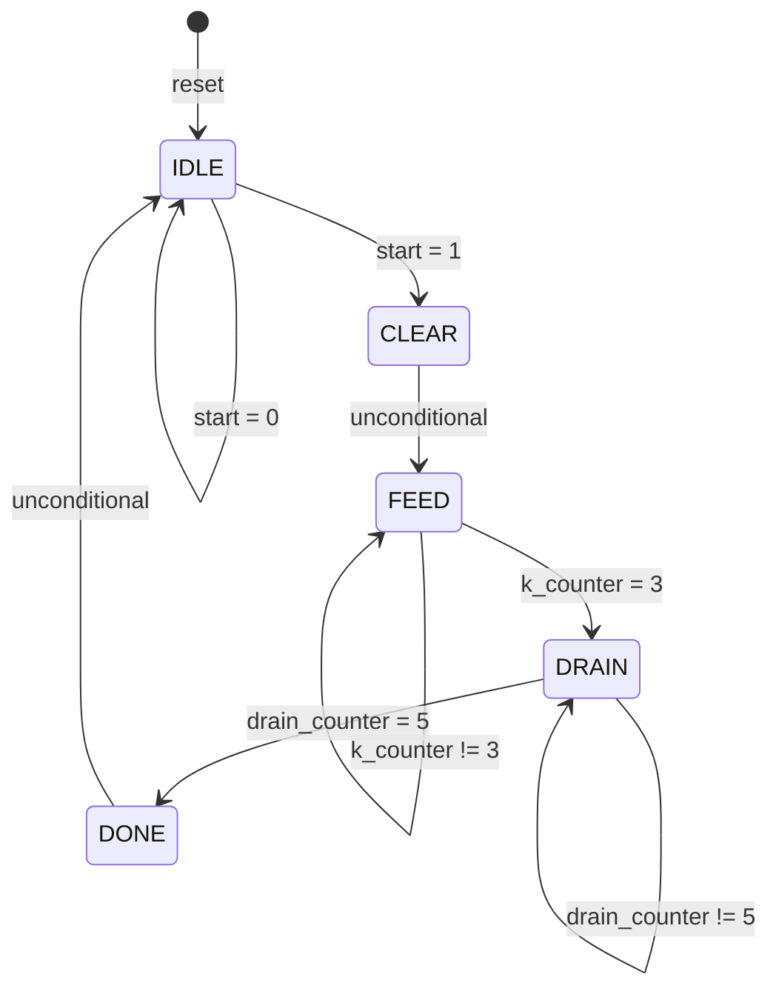

# Registered 4×4 Accelerator Controller Design Specification

## 1. Module overview

**Module:** `accelerator_4x4_controller_registered`

**Normative source:** [`../rtl/accelerator_4x4_controller_registered.sv`](../rtl/accelerator_4x4_controller_registered.sv). This document describes the implemented behavior, rather than proposed behavior. The comparison source is [`../rtl/accelerator_4x4_controller.sv`](../rtl/accelerator_4x4_controller.sv).

The module sequences a fixed-length accelerator operation: accumulator clear, four operand-feed cycles, six drain cycles, and a completion indication. It supplies control signals and the two-bit operand index; it contains no arithmetic datapath, operand storage, result checking, or datapath-completion input. Completion is determined entirely by its state and counters.

It is an interface-compatible alternative to `accelerator_4x4_controller`. Both implementations have the same state transitions, counters, and settled cycle-level output values. The new implementation registers the four control outputs using a decode of `next_state`; the original decodes the current registered state combinationally.

Integration context: the existing `accelerator_4x4_top.sv` still instantiates the original controller. There, `k_counter` selects an operand slice, `feed_valid` drives the input-valid lanes, and `clear_acc` connects to the core. Creating this alternative module does not itself replace that instance. This controller has no parameters; the feed and drain durations are fixed by RTL constants.

## 2. Interface specification

All ports are declared `logic`; vectors are unsigned.

| Signal | Direction | Width | Functional description |
|---|---|---:|---|
| `clk` | Input | 1 | Rising-edge clock for state, counters, and control-output registers. |
| `rst_n` | Input | 1 | Active-low asynchronous reset, used by both sequential blocks. |
| `start` | Input | 1 | Level-sensitive request examined only in IDLE. A high level at an eligible rising edge causes entry into CLEAR. |
| `busy` | Output | 1 | Registered indication asserted in CLEAR, FEED, and DRAIN. Low in IDLE and DONE. |
| `done` | Output | 1 | Registered completion indication asserted for the one-cycle DONE state, unless reset interrupts it. |
| `clear_acc` | Output | 1 | Registered clear control asserted only in CLEAR. |
| `feed_valid` | Output | 1 | Registered feed control asserted only in FEED. |
| `k_counter` | Output | 2 (`[1:0]`) | Registered operand index: 0, 1, 2, 3 over the four FEED cycles; zero outside FEED in normal operation. |

There is no ready signal, request queue, request-edge detector, stall input, or variable-latency completion handshake. `busy == 0` alone does not mean a request can be accepted: DONE also has `busy == 0`.

## 3. FSM architecture

`state` and `next_state` have type `state_t`, an enumeration with a three-bit base type. Implicit enum values are IDLE=0, CLEAR=1, FEED=2, DRAIN=3, DONE=4. These are RTL values; synthesis may recode the FSM.

| Current state | Purpose | Condition | Next state |
|---|---|---|---|
| IDLE | Wait for a request | `start == 0` | IDLE |
| IDLE | Wait for a request | `start == 1` | CLEAR |
| CLEAR | Assert accumulator-clear control for one cycle | Unconditional | FEED |
| FEED | Present four valid operand-index cycles | `k_counter != 2'd3` | FEED |
| FEED | End feeding after index 3 | `k_counter == 2'd3` | DRAIN |
| DRAIN | Provide six fixed drain cycles | `drain_counter != 3'd5` | DRAIN |
| DRAIN | End draining at count 5 | `drain_counter == 3'd5` | DONE |
| DONE | Assert completion for one cycle | Unconditional, regardless of `start` | IDLE |
| Unmatched state encoding | Default recovery | Unconditional | IDLE |

The combinational block initially assigns `next_state = state`, which supplies the self-loops when a terminal condition is false. Reset overrides normal transitions and sets state to IDLE. There is no normal path that skips CLEAR, FEED, DRAIN, or DONE.



Reset applies from every state. The default recovery path does not provide an error flag or establish general fault tolerance.

## 4. Registered output architecture

The implementation has one combinational next-state block and two sequential blocks:

1. The first sequential block registers `state <= next_state` and updates both counters using the **pre-edge current state** and counter values.
2. The combinational block derives `next_state` from `state`, `start`, `k_counter`, and `drain_counter`.
3. The second sequential block registers `busy`, `done`, `clear_acc`, and `feed_valid` from a decode of **`next_state`**.

```text
 start       state feedback       counter values
   |                |                   |
   +----------------+-------------------+
                    |
                    v
          +------------------+
          | next-state logic |  combinational
          +------------------+
                    |
                next_state
                    |
          +---------+--------------+
          |                        |
          v                        v
     +----------+           +---------------+
     | state FF |           | output decode | combinational function
     +----------+           +---------------+ of next_state
          |                        |
          |                        v
          |                  +-----------+
          |                  | output FF |
          |                  +-----------+
          v                        |
        state                      v
                          busy / done /
                          clear_acc / feed_valid

 clk rising edge and asynchronous rst_n reset both FF groups.
 Counter FFs separately use pre-edge state and counter values.
```

Although the output decode is written inside `always_ff`, its decode function determines the D inputs of the output registers. State and the four control outputs therefore update on the same rising edge. They are aligned after nonblocking assignments settle; there is no extra output cycle of latency relative to state. Asynchronous reset can also update them without a rising edge.

## 5. State / output table

These values describe the registered outputs aligned with the post-edge state in normal, reset-initialized operation. They are not a continuously evaluated combinational decode of `state` in this module.

| State | `busy` | `done` | `clear_acc` | `feed_valid` |
|---|---:|---:|---:|---:|
| IDLE | 0 | 0 | 0 | 0 |
| CLEAR | 1 | 0 | 1 | 0 |
| FEED | 1 | 0 | 0 | 1 |
| DRAIN | 1 | 0 | 0 | 0 |
| DONE | 0 | 1 | 0 | 0 |

Each non-reset output update first schedules zero for all four outputs, then schedules the relevant assertions in `case (next_state)`. The later assignment to a given register in the same sequential block takes precedence. The default case leaves all four zero.

## 6. Counter behavior

There are exactly two counters.

| Property | `k_counter` | `drain_counter` |
|---|---|---|
| Purpose | Select the four feed indices | Time the fixed drain interval |
| Visibility | Output port | Internal signal |
| Width | 2 bits | 3 bits |
| Asynchronous reset value | `2'd0` | `3'd0` |
| Increment condition | Pre-edge `state == FEED` and `k_counter != 2'd3` | Pre-edge `state == DRAIN` and `drain_counter != 3'd5` |
| Increment | `+ 2'd1` | `+ 3'd1` |
| Terminal count | 3 | 5 |
| Terminal counter action | Reset to zero on the edge ending terminal FEED | Reset to zero on the edge ending terminal DRAIN |
| Terminal state transition | FEED → DRAIN | DRAIN → DONE |
| Outside counting state | Assign zero on every rising edge | Assign zero on every rising edge |

On CLEAR → FEED, the pre-edge state is CLEAR, so `k_counter` remains zero. FEED thus occupies four full intervals with counts **0, 1, 2, 3**. The edge leaving FEED sees the old count 3, enters DRAIN, and resets `k_counter` to zero. There is no fifth FEED interval for the wrapped zero.

On FEED → DRAIN, the pre-edge state is FEED, so `drain_counter` remains zero. DRAIN occupies six full intervals with counts **0, 1, 2, 3, 4, 5**. The six edges whose pre-edge state is DRAIN see counts 0 through 5; the sixth enters DONE and resets the counter. The DRAIN-entry edge is not one of those six DRAIN-processing edges.

Terminal tests use the pre-edge count, not the incremented count. For normal reachable operation, inclusive zero-based counting yields terminal count plus one intervals: four FEED and six DRAIN. Counts 6 and 7 are not reached by `drain_counter` during normal operation. The comparison is equality to 5, not saturation or a greater-than-or-equal check; the RTL does not implement special recovery for corrupted counter values.

## 7. Cycle-level operation

Assume reset has initialized the module, `rst_n` remains high, and `start` is high for acceptance at edge E0 and then low. Each row shows values **after that edge's nonblocking assignments settle**, maintained through the following clock interval. The initial row is the IDLE interval preceding E0. Both counters are shown, including the internal drain counter.

| Edge / interval | State | `k_counter` | `drain_counter` | `busy` | `clear_acc` | `feed_valid` | `done` |
|---|---|---:|---:|---:|---:|---:|---:|
| Before E0 | IDLE | 0 | 0 | 0 | 0 | 0 | 0 |
| E0: accept start | CLEAR | 0 | 0 | 1 | 1 | 0 | 0 |
| E1 | FEED | 0 | 0 | 1 | 0 | 1 | 0 |
| E2 | FEED | 1 | 0 | 1 | 0 | 1 | 0 |
| E3 | FEED | 2 | 0 | 1 | 0 | 1 | 0 |
| E4 | FEED | 3 | 0 | 1 | 0 | 1 | 0 |
| E5 | DRAIN | 0 | 0 | 1 | 0 | 0 | 0 |
| E6 | DRAIN | 0 | 1 | 1 | 0 | 0 | 0 |
| E7 | DRAIN | 0 | 2 | 1 | 0 | 0 | 0 |
| E8 | DRAIN | 0 | 3 | 1 | 0 | 0 | 0 |
| E9 | DRAIN | 0 | 4 | 1 | 0 | 0 | 0 |
| E10 | DRAIN | 0 | 5 | 1 | 0 | 0 | 0 |
| E11 | DONE | 0 | 0 | 0 | 0 | 0 | 1 |
| E12 | IDLE | 0 | 0 | 0 | 0 | 0 | 0 |

| Phase | Exact duration | Intervals |
|---|---:|---|
| CLEAR | 1 cycle | E0–E1 |
| FEED | 4 cycles | E1–E5 |
| DRAIN | 6 cycles | E5–E11 |
| DONE | 1 cycle | E11–E12 |

`busy` is high for 11 cycles, from E0 to E11. `done` rises 11 clock periods after acceptance and remains high for one period. The controller returns to IDLE 12 periods after acceptance. Reset can truncate any of these intervals.

A synchronous consumer samples pre-edge controls: it sees `clear_acc == 1` at E1 and the four valid feed indices at E2 through E5. At E5, that consumer still samples index 3 with `feed_valid == 1`, even though the controller becomes DRAIN after the edge. Similarly, the six edges with pre-edge DRAIN are E6 through E11. This distinction prevents confusing post-edge state labels with values consumed on the edge. The controller alone does not prove the datapath result is correct or available after this fixed interval.

## 8. Start behavior

`start` is accepted only on a rising edge with reset inactive and pre-edge state IDLE. It is a level request, not an edge-detected event. It must meet the clock's sampling requirements; no input synchronizer is implemented.

During CLEAR, FEED, and DRAIN, `start` has no effect on the transitions or counters. Such a request is not saved. During DONE it is also ignored: DONE unconditionally goes to IDLE. A pulse that ends before an eligible IDLE sampling edge is lost.

A new operation can begin on the rising edge following the return to IDLE, if `start` is high then. In the example, the earliest next acceptance is E13, with one full IDLE interval E12–E13. Holding `start` continuously high causes repeated operations with acceptance edges 13 clock periods apart. No deassertion is required to rearm the controller. A request held through the busy and DONE intervals is accepted when IDLE is subsequently sampled.

## 9. Reset behavior

Both sequential blocks use `always_ff @(posedge clk or negedge rst_n)` with `if (!rst_n)`. Reset assertion is asynchronous and active low; holding reset low also selects reset behavior at each rising edge.

| Registered object | Reset value |
|---|---|
| `state` | IDLE |
| `k_counter` | 0 |
| `drain_counter` | 0 |
| `busy` | 0 |
| `done` | 0 |
| `clear_acc` | 0 |
| `feed_valid` | 0 |

`next_state` is combinational and has no reset assignment or reset gating. With reset asserted, state IDLE, and `start` high, it can evaluate to CLEAR while the registers remain reset. Reset release itself does not clock the registers. At the first rising edge with `rst_n` high, the controller may immediately enter CLEAR if `start` is high.

Reset aborts an in-progress operation without generating a completion pulse and clears any current DONE indication. No reset-release synchronizer is present; physical recovery/removal requirements are an integration concern. Defined startup values require reset; the module has no initialization block.

## 10. Timing semantics

The output block decodes `next_state` so it registers the controls for the same destination state that the state register is about to capture.

```text
Before rising edge, with rst_n = 1 and start = 1:
    state      = IDLE
    next_state = CLEAR
    busy       = 0
    clear_acc  = 0

After rising edge and nonblocking assignments settle:
    state      = CLEAR
    busy       = 1
    clear_acc  = 1
    done       = 0
    feed_valid = 0

After combinational logic settles again:
    next_state = FEED
    (registered outputs still describe CLEAR until the next edge)
```

SystemVerilog nonblocking assignments evaluate their right-hand sides when the sequential blocks execute and schedule register updates for the nonblocking-assignment region. Thus `state <= next_state` and the output block's `case (next_state)` use the same pre-update destination state. Neither block depends on the other block executing first. Counter conditions likewise see the old `state`, preserving zero on entry and the full terminal interval on exit.

The subsequent change in `state` or counters can recompute `next_state`, but does not re-execute the output sequential block until another clock or reset event. Sampling immediately in the active region of a rising edge observes old register values; verification must distinguish pre-edge sampling from settled post-edge observation. Physical register outputs have clock-to-Q delays and skew; “same edge” describes logical cycle alignment, not identical analog transition instants.

## 11. Comparison with the original controller

| Architectural feature | `accelerator_4x4_controller` | `accelerator_4x4_controller_registered` |
|---|---|---|
| State storage | Registered | Registered |
| Next-state logic | Combinational | Same combinational transitions |
| Counters | Registered; use current pre-edge state | Same behavior |
| Four control outputs | Current-state-derived combinational Moore decode | Next-state-derived decode captured in output registers |
| Output reset behavior | Zero follows reset state through combinational decode | Explicit asynchronous reset of output registers |
| State-to-output implementation | State FF → decode → output | Output FF → output |
| Control register D-input logic | No separate control-output FFs | Depends on next-state logic and output decode |
| Normal settled cycle-level behavior | CLEAR=1, FEED=4, DRAIN=6, DONE=1 cycles | Same durations and output table |

The registered version retains Moore-like state/output alignment in normal operation, although its output-register input equations use `next_state`. It adds no transaction cycle relative to the original. The original's `done` is not a separate register, even though it follows a registered DONE state. Neither architecture is universally preferable; physical timing, area, and interface requirements determine the tradeoff.

## 12. Verification considerations

The following are verification targets, not claims that tests have already passed. Unless testing reset itself, duration and sequence properties assume reset remains inactive and the module starts from a reset-established state.

| Property | Expected observation |
|---|---|
| Reset assertion | Assert reset between clock edges and in every state; all listed registers take their reset values without waiting for a rising clock edge. |
| Reset release | Low `start` leaves IDLE; high `start` allows CLEAR on the first eligible rising edge. No stale counter or completion state survives reset. |
| Legal sequence | Accepted start produces IDLE → CLEAR → FEED → DRAIN → DONE → IDLE, with only the documented self-loops. |
| Output alignment | After updates settle, the four registered outputs match the state/output table on every cycle. |
| Clear control | `clear_acc` is high if and only if state is CLEAR in normal operation; exactly one cycle per uninterrupted operation. |
| Feed control | `feed_valid` is high if and only if state is FEED; exactly four cycles with indices 0, 1, 2, 3. |
| Busy indication | `busy` is high exactly in CLEAR, FEED, and DRAIN; 11 consecutive cycles per operation; low in DONE. |
| Completion | `done` is high exactly in DONE for one cycle; next cycle is IDLE with `done == 0`. Reset may shorten the pulse. |
| Feed terminal | Count 3 is a valid FEED interval; its ending edge enters DRAIN and resets `k_counter`. |
| Drain terminal | Counts 0 through 5 occupy six DRAIN intervals; the edge seeing pre-edge count 5 enters DONE and resets the counter. |
| Counter entry and inactivity | Each counter is zero on entry to its counting state and outside that state during normal operation. |
| Off-by-one prevention | Distinguish entry edges from processing edges; verify 1/4/6/1 durations and E11 completion relative to E0 acceptance. |
| Start while active | Pulses confined to CLEAR, FEED, or DRAIN cause no restart, extension, or queued transaction. |
| Start during DONE | A pulse confined to DONE is ignored despite `busy == 0`; DONE always proceeds to IDLE. |
| Repeated start | A held-high request produces the required intervening IDLE cycle and acceptance every 13 periods; a later independent IDLE request also starts normally. |
| Cross-implementation comparison | Under identical reset and input stimulus, settled states, counters, and controls agree with the original on normal reachable cycles. |

Assertions and scoreboards must use a consistent sampling convention. Concurrent assertions clocked on `posedge clk` normally sample before that edge's nonblocking updates; expected transitions must account for that. A procedural post-edge checker must wait until updates settle. Do not mistake simulator scheduling for an extra output cycle. Datapath completion correctness requires separate integration verification if this controller is instantiated in the accelerator.

## 13. Design notes and tradeoffs

Registering the controls gives downstream logic outputs driven directly by flip-flops and removes the current-state combinational decode from the external output path. Between clock edges, next-state decode changes do not propagate directly to these outputs, except for the independent asynchronous reset behavior. This can simplify downstream timing and avoid exposing combinational decode transients.

The decode logic is not eliminated from the circuit: it moves to the output-register D-input logic. A potential path is state/counter FF → terminal comparison and next-state logic → output decode → output FF. The IDLE request path similarly runs from `start` through next-state and output-decode logic to the output registers. These paths must meet setup timing. Extra registers and their clock/reset loading are additional costs; actual area, critical path, and performance require synthesis and timing analysis.

If the output sequential block decoded **current `state`** instead, its nonblocking assignments would capture controls for the pre-edge state while the state register captured `next_state`. On IDLE → CLEAR, state would become CLEAR but outputs would retain IDLE values; on CLEAR → FEED, clear would assert while state was already FEED. That would introduce a one-cycle state/output misalignment and could also misalign feed-valid with the independently updated index. Decoding `next_state` avoids this delay without changing the counters' pre-edge-state semantics.

Noteworthy implementation boundaries:

- DONE is not busy but does not accept start. An external requester cannot use `!busy` alone as an acceptance handshake.
- A continuously high start repeats operations; there is no one-shot rearm or pending-request storage.
- Drain length is fixed at six cycles and has no feedback from the datapath. This document does not infer result correctness from the terminal count alone.
- The existing top level still selects the original module; the registered variant is not automatically integrated.

No inconsistency was found between the registered variant's normal state timing and its stated next-state-derived registered-output architecture. The observations above are implemented protocol and integration constraints, rather than inferred design defects.
